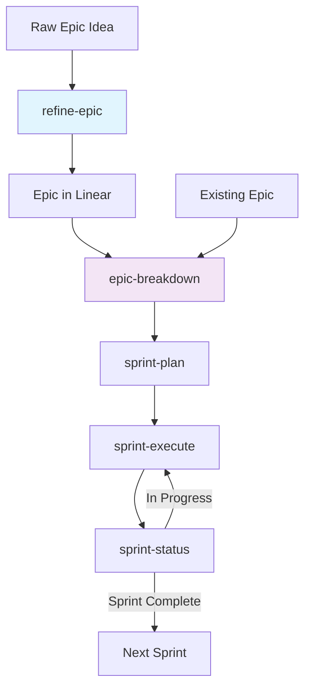

# Linear Sprint Management Commands

A comprehensive suite of AI-powered sprint management commands that integrate with Linear to automate epic breakdown, sprint planning, and parallel execution with AI agents.

## 📋 Command Overview

The Linear command suite provides end-to-end sprint management capabilities:

| Command | Purpose | Phase |
|---------|---------|-------|
| **refine-epic** | Create or enhance epics with comprehensive/lite templates | Definition |
| **epic-breakdown** | Prepare epic structure and create features/tasks hierarchy | Planning |
| ~~**epic-prep**~~ | ⚠️ DEPRECATED - Now part of epic-breakdown | - |
| ~~**refine-epic-lite**~~ | ⚠️ DEPRECATED - Use refine-epic --lite | - |
| **issue-execute** | Execute specific Linear issues ad-hoc with AI agents | Execution |
| **sprint-plan** | Create optimized sprint project from backlog | Planning |
| **sprint-execute** | Execute sprint with parallel AI agents | Execution |
| **sprint-status** | Monitor sprint progress and agent activity | Monitoring |

## Understanding Linear Command Arguments

Linear commands use a mix of **positional arguments** and **natural language patterns** depending on command complexity.

### Positional Argument Commands
Commands like `/sprint-execute`, `/sprint-plan`, and `/epic-breakdown` use fixed positional parameters:

```bash
/sprint-execute <project-name> [epic-id]
/sprint-plan <team-name> <epic-id> [max-sprints] [dry-run]
```

These work like function calls - parameters must be in the specified order.

### Natural Language Commands
Commands like `/refine-epic`, `/refine-issue`, and `/issue-execute` use flexible natural language:

```bash
/refine-epic CCC-123 lite analyze codebase
/issue-execute CCC-101,CCC-102 force dry-run team Chronicle
/sprint-status Chronicle active detailed
```

These detect keywords and patterns in your input, allowing flexible ordering.

### Reading Command Signatures

- `<required>` = required parameter
- `[optional]` = optional parameter
- `<id1,id2>` = comma-separated list
- Keywords like `[force]`, `[lite]` = optional flags to include

## 🔄 Workflow



## 📚 Command Details

### 0. refine-epic
**Purpose**: Create new epics from ideas or enhance existing ones with comprehensive PRD templates or lightweight 1-pagers.

**Usage**:
```bash
# Enhance existing epic with comprehensive template
/refine-epic EPIC-123

# Create new epic with lite template
/refine-epic --team "Chronicle" --lite

# Add codebase analysis for technical context
/refine-epic EPIC-123 --analyze-codebase

# Combine lite template with codebase insights
/refine-epic --team "Chronicle" --lite --analyze-codebase
```

**Key Features**:
- **Dual Templates**: Comprehensive PRD or lightweight 1-pager
- **Codebase Analysis**: Parallel agents analyze technical context
- **Interactive Mode**: Guided epic creation with prompts
- **Template Switching**: Easy migration between comprehensive and lite
- **AI-Optimized**: Structured for downstream epic-breakdown consumption

**Template Types**:
- **Comprehensive**: Full PRD with user journeys, NFRs, test strategy (5+ pages)
- **Lite**: Essential 1-pager with problem, solution, success criteria (~1 page)

**Output**:
- Well-structured Linear epic ready for breakdown
- Technical context from codebase analysis
- Clear acceptance criteria and scope definition

### 1. epic-breakdown
**Purpose**: Prepares epic structure, analyzes readiness, and creates a complete hierarchy of features and tasks optimized for AI agent execution.

**Usage**:
```bash
/epic-breakdown <team-name> <epic-id>
/epic-breakdown <team-name> <epic-id> yes  # Skip preparation phase
```

**Key Features**:
- **Integrated Preparation**: Includes all epic-prep functionality as first phase
- **Structure Fixing**: Creates missing features, matches orphans, fixes metadata
- **Readiness Validation**: Ensures epic has required sections and criteria
- **Parallel Codebase Analysis**: Launches agents to examine technical context
- **Smart Feature Sizing**: Creates properly-sized features (1-5 days for AI agents)
- **Task Generation**: Generates implementation tasks (max 5 per feature)
- **Dependency Mapping**: Sets up dependencies and phase assignments
- **Parallelization Optimization**: Maximizes concurrent execution opportunities

**Two-Phase Process**:
1. **Preparation Phase**: Structure validation and fixes (formerly epic-prep)
2. **Breakdown Phase**: Feature and task creation with analysis

**Output**:
- Structurally sound epic with proper feature hierarchy
- Created Linear features and tasks under the epic
- Dependency relationships and phase assignments
- Sprint planning recommendations with parallelization analysis

### 2. issue-execute
**Purpose**: Execute specific Linear issues by ID with automatic dependency resolution, phase detection, and parallel subagent orchestration. Perfect for ad-hoc development, hot fixes, or executing individual features outside of sprint cycles.

**Usage**:
```bash
/issue-execute --issue <id>                # Single issue
/issue-execute --issues <id1,id2,id3>      # Multiple issues
/issue-execute --team <team-name>          # Team context
/issue-execute --force                     # Execute despite blockers
/issue-execute --dry-run                   # Preview execution plan
```

**Key Features**:
- Direct issue execution without sprint/project context
- Automatic dependency and blocker resolution
- Smart phase detection based on labels and dependencies
- Maximum parallelization for independent issues
- Real-time Linear progress tracking
- Subtask handling and status updates
- Retry logic for failed agents

**Execution Strategy**:
- Fetches complete issue details including subtasks
- Analyzes blocking relationships and dependencies
- Assigns issues to foundation/features/integration phases
- Groups related issues by technical area
- Launches parallel agents for independent work
- Updates Linear with progress comments and status changes

**Output**:
- Execution plan preview (with --dry-run)
- Real-time progress updates in Linear
- Agent assignment and specialization details
- Final summary with completion statistics

### 3. ~~epic-prep~~ ⚠️ DEPRECATED
**This command has been consolidated into epic-breakdown.**

**Migration**:
```bash
# Old workflow:
/epic-prep Chronicle EPIC-123 yes
/epic-breakdown Chronicle EPIC-123

# New consolidated workflow:
/epic-breakdown Chronicle EPIC-123
```

**Legacy Purpose**: Ensured epic was properly structured with features, tasks, and metadata.
**Now Available In**: All epic-prep functionality is now the first phase of epic-breakdown.

### ~~refine-epic-lite~~ ⚠️ DEPRECATED 
**This command has been consolidated into refine-epic.**

**Migration**:
```bash
# Old command:
/refine-epic-lite CCC-123
/refine-epic-lite --team "Chronicle"

# New consolidated command:
/refine-epic CCC-123 --lite
/refine-epic --team "Chronicle" --lite
```

**Legacy Purpose**: Quick epic refinement with minimal 1-pager template.
**Now Available In**: Use `/refine-epic --lite` for the same lightweight template.

### 4. sprint-plan
**Purpose**: Breaks down a Linear epic into multiple focused sprint projects, prioritizing parallelization and avoiding dependency clashes.

**Usage**:
```bash
/sprint-plan <team-name> <epic-id> [max-sprints] [dry-run]
```

**Key Changes**:
- Now creates **multiple sprint projects** from a single epic
- Uses naming convention: `[EPIC-ID].S[NN]` (e.g., CHR-25.S01, CHR-25.S02)
- Prefers smaller, focused sprints (3-8 issues) over large ones
- Supports `--dry-run` to preview sprint breakdown without creating projects
- Handles pagination for large epics (50+ issues)

**Sprint Strategy**:
- Groups related features to avoid dependency clashes
- Maps cross-sprint dependencies
- Orders sprints for clean handoffs
- Each sprint has clear focus and deliverables

**Output**:
- Multiple Linear sprint projects (CHR-25.S01, CHR-25.S02, etc.)
- Issues distributed across sprints by dependencies
- Clear execution order with dependency map
- Ready for sequential sprint execution

### 5. sprint-execute
**Purpose**: Executes a sprint by launching parallel AI agents to implement Linear issues.

**Usage**:
```bash
/sprint-execute <project-name>
```

**Execution Phases**:
1. **Foundation Phase**: Minimal - only true blockers
2. **Features Phase**: Maximum parallelization (70-90% of work)
3. **Integration Phase**: Final testing and integration

**Enhanced Linear Integration**:
- Agents post real-time progress comments to Linear issues
- Starting message: "🤖 Agent-N starting work"
- Progress updates at major milestones
- Final summary with files modified
- Automatic status updates (In Progress → In Review → Done)
- Full audit trail maintained in Linear

**Agent Assignment**:
- Groups issues by technical area
- 1-3 issues per agent
- Specializations based on Linear labels
- Incremental agent numbering for tracking

### 6. sprint-status
**Purpose**: Monitors sprint progress, active agents, and blocked issues.

**Usage**:
```bash
/sprint-status [--team <team>] [--project <project>] [--active] [--detailed]
```

**View Options**:
- **Default**: Summary of all sprints
- **--team**: All sprints for specific team
- **--project**: Detailed view of single sprint
- **--active**: Only currently executing sprints
- **--detailed**: Include issue-level details

**Metrics Provided**:
- Completion percentages by phase
- Active agent assignments
- Blocked issues with reasons
- Parallelization analysis
- Recent activity timeline

## 🚀 Complete Workflow Example

### Step 1: Create and Refine Epic
```bash
# Option 1: Create new epic from idea
/refine-epic --team Chronicle --lite  # For quick MVP/prototype epics
# OR
/refine-epic --team Chronicle         # For comprehensive production epics

# Option 2: Enhance existing epic
/refine-epic EPIC-123                 # Add comprehensive structure
# OR  
/refine-epic EPIC-123 --lite          # Convert to lightweight format

# Option 3: Add technical context
/refine-epic EPIC-123 --analyze-codebase  # Include codebase analysis
```

### Step 2: Prepare and Break Down Epic
```bash
# Prepare structure and create features/tasks (all-in-one)
/epic-breakdown Chronicle EPIC-123

# If epic structure is already perfect, skip preparation
/epic-breakdown Chronicle EPIC-123 yes

# This does:
# - Structure preparation (missing features, orphan matching, metadata fixes)
# - Readiness validation
# - Parallel codebase analysis
# - Feature and task creation
# - Dependency mapping
# - Creates: 12 features across 3 phases, 43 implementation tasks
```

### Step 3: Plan Sprints
```bash
# Break epic into multiple sprint projects
/sprint-plan Chronicle EPIC-123

# Output:
# Created 6 sprint projects:
# CHR-123.S01: Critical Fixes (8 issues)
# CHR-123.S02: Type System (9 issues)
# CHR-123.S03: Display Components (12 issues)
# CHR-123.S04: Integration (10 issues)
# CHR-123.S05: Production UI (6 issues)
# CHR-123.S06: Documentation (2 issues)
```

### Step 4: Execute Sprints Sequentially
```bash
# Execute first sprint
/sprint-execute "CHR-123.S01"

# After S01 completes, execute next sprint
/sprint-execute "CHR-123.S02"

# Continue through all sprints in order
# Each sprint execution:
# - Updates Linear issues in real-time
# - Agents post progress comments
# - Full audit trail in Linear
```

### Step 5: Monitor Progress
```bash
# Check specific sprint status
/sprint-status --project "CHR-123.S02" --detailed

# Or check all sprints for the team
/sprint-status --team Chronicle

# Shows:
# - Completion percentage per sprint
# - Active agents and current work
# - Blocked issues
# - Recent activity from Linear comments
```

## ⚡ Parallelization Strategy

The commands optimize for maximum concurrent execution:

### Phase Distribution Goals
- **Foundation**: <10% (only critical dependencies)
- **Features**: 70-90% (maximize parallelization)
- **Integration**: <20% (final validation)

### Agent Concurrency
- Launch all agents in a phase simultaneously
- Group related issues per agent (1-3 issues)
- Assign specializations based on technical areas
- No artificial sequencing unless dependencies exist

### Dependency Management
- Explicit blocks/blocked-by relationships respected
- Parent-child hierarchies maintained
- Technical dependencies identified from descriptions
- Default assumption: everything can parallelize

## 🏷️ Linear Label Convention

The commands use standardized labels:

### Phase Labels
- `phase:foundation` - Must run first
- `phase:features` - Main parallel work
- `phase:integration` - Final integration

### Type Labels
- `type:epic` - Epic level issue
- `type:feature` - Feature with subtasks
- `type:task` - Implementation task

### Technical Area Labels
- `area:frontend` - UI/UX work
- `area:backend` - Server-side logic
- `area:database` - Data layer
- `area:infrastructure` - DevOps/config
- `area:testing` - Test implementation

### Complexity Labels
- `complexity:small` - 1-2 day effort
- `complexity:medium` - 2-3 day effort
- `complexity:large` - 3-5 day effort
- `complexity:xl` - Needs breakdown

### Status Labels
- `sprint-planned` - Added to sprint
- `agent:N` - Assigned to agent N
- `implemented` - Completed by agent

## 📊 Best Practices

### Epic Structure
1. **Clear Objectives**: Define problem, solution, and success metrics
2. **User Stories**: Include "As a user..." stories with benefits
3. **Acceptance Criteria**: Measurable, testable requirements
4. **Technical Requirements**: Specify constraints and approaches
5. **Proper Sizing**: Epics should be 3-5 sprints maximum

### Feature Sizing
- **Small**: Single component, 1-3 tasks, 1-2 days
- **Medium**: Multiple components, 3-5 tasks, 2-3 days
- **Large**: Complete subsystem, 5-8 tasks, 3-5 days
- **Too Large**: Split into multiple features

### Sprint Composition
- Mix of complexities (not all hard or all easy)
- 80%+ issues with clear acceptance criteria
- Minimize dependencies between agents
- Include testing and documentation tasks
- Leave buffer for discovered work

### Agent Execution
- Provide clear, focused prompts to agents
- Include relevant documentation references
- Specify technical approach when known
- Set quality standards upfront
- Monitor progress with sprint-status

## 🔧 Troubleshooting

### Common Issues

**Epic Not Ready**:
- Missing required sections in description
- No acceptance criteria defined
- Vague or incomplete objectives
- Solution: Run epic-prep to identify gaps

**Poor Parallelization**:
- Too many dependencies identified
- Features too tightly coupled
- Solution: Review and split features differently

**Agent Failures**:
- Unclear requirements in Linear issues
- Missing technical context
- Solution: Update issue descriptions with details

**Blocked Issues**:
- External dependencies not resolved
- Waiting for reviews or approvals
- Solution: Escalate or find workarounds

### Debug Commands
```bash
# Check epic structure (use epic-breakdown instead, epic-prep is deprecated)
/epic-breakdown <team> <epic>

# View sprint composition
/sprint-status --project <project> --detailed

# See all team sprints
/sprint-status --team <team>
```

## 🔗 Integration Points

### Linear API
All commands use the `linctl` CLI tool via Bash:
- `linctl issue list` - Query issues with flexible filters
- `linctl issue create` - Create features/tasks with templates
- `linctl issue update` - Update states/metadata/relationships
- `linctl comment create` - Add progress notes and updates

The linctl CLI provides:
- Native CLI interface matching Linear's data model
- Structured JSON output for parsing with `--json` flag
- Full access to Linear's API capabilities
- Reliable execution without token overhead

### Git Integration
Sprint-execute creates commits with:
- Linear issue references in commit messages
- Format: `Implement [LINEAR-123]: Description`
- Grouped by phase completion

### Agent Communication
- Agents log to `tmp/worklog/sprintagent-N.log`
- Sprint summary in `tmp/worklog/sprint-linear.log`
- Progress tracked via Linear issue states

## 📈 Metrics and Reporting

### Sprint Metrics
- **Completion Rate**: Issues done / total
- **Parallelization Rate**: Features phase %
- **Agent Efficiency**: Issues per agent
- **Cycle Time**: Time from start to done
- **Blockage Rate**: Blocked issues %

### Success Indicators
- ⚡ >80% parallelization
- 🚀 >5 agents concurrent
- ✅ 100% completion
- 🎯 All acceptance criteria met
- 📊 No regression in tests

### Warning Signs
- ⚠️ <60% parallelization
- 🚨 >20% issues blocked
- ⏰ Sprint >10 days old
- 💤 Agents stalled >1 hour
- ❌ Multiple agent failures

## 🎯 Command Selection Guide

| Scenario | Command to Use |
|----------|---------------|
| Create new epic from idea | `refine-epic --team <team> [--lite]` |
| Enhance existing epic | `refine-epic <epic-id> [--lite] [--analyze-codebase]` |
| Epic needs structure + breakdown | `epic-breakdown --team <team> --epic <id>` |
| Epic ready for sprint | `sprint-plan` → `sprint-execute` |
| Single hot fix needed | `issue-execute --issue <id>` |
| Multiple features to implement | `issue-execute --issues <ids>` |
| Check current progress | `sprint-status` |
| Perfect epic, skip prep | `epic-breakdown --team <team> --epic <id> --skip-prep` |
| Start next sprint | `sprint-plan` → `sprint-execute` |
| Debug blocked sprint | `sprint-status --detailed` |
| Ad-hoc issue execution | `issue-execute --dry-run` → `issue-execute` |

## 📝 Example Linear Epic Structure

```markdown
## Problem Statement
Users cannot authenticate securely with the application...

## User Stories
- As a user, I want to sign up with email/password
- As a user, I want to sign in with Google OAuth
- As a returning user, I want persistent sessions

## Acceptance Criteria
- [ ] Users can register with email/password
- [ ] Password requirements enforced (8+ chars, etc.)
- [ ] Google OAuth integration working
- [ ] JWT tokens generated and validated
- [ ] Sessions persist for 30 days
- [ ] Rate limiting prevents brute force

## Technical Requirements
- JWT for token management
- Redis for session storage
- bcrypt for password hashing
- Google OAuth 2.0 integration
- Rate limiting middleware

## Success Metrics
- 0 security vulnerabilities
- <200ms authentication time
- 99.9% uptime for auth service
```

This structure ensures epic-breakdown can properly analyze and create features.