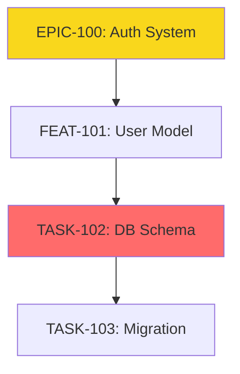

# Linear Dependency Mapping Command

Comprehensive dependency analysis tool that maps relationships across all Linear issue types, identifies blocking chains, detects circular dependencies, and generates visual dependency reports for better project planning.

## Usage
- `$1` (team-name): (Required) Linear team name to analyze
- `$2` (scope): (Optional) Scope of analysis - can be "all", "release", "epic", "sprint", "project", or a specific ID (default: all)
- `$3` (format): (Optional) Output format: text, mermaid, csv, json (default: text)

## Dependency Types

### Direct Dependencies
- **Blocks/Blocked By**: Hard dependencies that prevent progress
- **Parent/Child**: Hierarchical decomposition dependencies
- **Related**: Soft dependencies for context

### Indirect Dependencies
- **Transitive**: A→B→C means A transitively depends on C
- **Cross-Phase**: Dependencies across sprint phases
- **Cross-Team**: Dependencies on other teams' work

### Dependency Health
- 🟢 **Healthy**: No blockers, clear path
- 🟡 **Warning**: Long chains, cross-team deps
- 🔴 **Critical**: Circular deps, blocked critical path

## Instructions

### Step 1: Initialize Analysis
1. **Launch Program Manager Agent**:
   ```
   Use the program-manager subagent for comprehensive dependency analysis
   
   Prompt: "Perform complete dependency analysis for team $TEAM 
   with scope $SCOPE. Identify all blocking relationships, circular 
   dependencies, and critical paths. Generate dependency metrics."
   ```

2. **Set Analysis Parameters**:
   - Define scope boundaries
   - Set traversal depth
   - Configure output format
   - Enable external dependencies if needed

### Step 2: Fetch Issue Data

1. **Gather Issues by Scope**:
   ```python
   if scope == "release":
     issues = mcp__linear__list_issues(
       team: team,
       label: f"release:{scope_id}"
     )
   elif scope == "epic":
     epic = mcp__linear__get_issue(scope_id)
     issues = get_epic_children(epic)
   elif scope == "sprint":
     issues = mcp__linear__list_issues(
       team: team,
       project: scope_id
     )
   else:  # all
     issues = mcp__linear__list_issues(
       team: team,
       includeArchived: false
     )
   ```

2. **Extract Relationships**:
   ```python
   for issue in issues:
     relationships[issue.id] = {
       "blocks": issue.blocks,
       "blocked_by": issue.blockedBy,
       "parent": issue.parentId,
       "children": issue.children,
       "related": issue.relatedIssues
     }
   ```

3. **Include External Dependencies**:
   ```python
   if show_external:
     for issue in issues:
       for blocked_id in issue.blockedBy:
         if blocked_id not in issues:
           external_issue = mcp__linear__get_issue(blocked_id)
           external_deps.append(external_issue)
   ```

### Step 3: Build Dependency Graph

1. **Create Node Structure**:
   ```python
   class DependencyNode:
     id: str
     title: str
     type: str  # epic, feature, task
     state: str
     priority: int
     blocks: List[str]
     blocked_by: List[str]
     depth: int
     critical: bool
   ```

2. **Build Adjacency Lists**:
   ```python
   forward_graph = {}  # What this blocks
   reverse_graph = {}  # What blocks this
   
   for issue in issues:
     forward_graph[issue.id] = issue.blocks
     reverse_graph[issue.id] = issue.blocked_by
   ```

3. **Calculate Dependency Depth**:
   ```python
   def calculate_depth(node_id, graph, visited=set()):
     if node_id in visited:
       return -1  # Circular dependency
     
     visited.add(node_id)
     if not graph.get(node_id):
       return 0
     
     max_depth = 0
     for dep in graph[node_id]:
       depth = calculate_depth(dep, graph, visited.copy())
       if depth == -1:
         return -1
       max_depth = max(max_depth, depth + 1)
     
     return max_depth
   ```

### Step 4: Analyze Dependencies

1. **Detect Circular Dependencies**:
   ```python
   def find_cycles(graph):
     def dfs(node, visited, rec_stack, path):
       visited[node] = True
       rec_stack[node] = True
       path.append(node)
       
       for neighbor in graph.get(node, []):
         if not visited.get(neighbor):
           cycle = dfs(neighbor, visited, rec_stack, path.copy())
           if cycle:
             return cycle
         elif rec_stack.get(neighbor):
           # Found cycle
           cycle_start = path.index(neighbor)
           return path[cycle_start:]
       
       rec_stack[node] = False
       return None
   ```

2. **Find Critical Path**:
   ```python
   def find_critical_path(graph):
     # Topological sort with longest path
     distances = {node: 0 for node in graph}
     
     for node in topological_order:
       for neighbor in graph[node]:
         distances[neighbor] = max(
           distances[neighbor],
           distances[node] + 1
         )
     
     # Reconstruct path
     critical_path = []
     current = max(distances, key=distances.get)
     while current:
       critical_path.append(current)
       current = get_predecessor(current)
     
     return critical_path
   ```

3. **Calculate Metrics**:
   ```python
   metrics = {
     "total_dependencies": len(all_deps),
     "max_chain_length": max_depth,
     "circular_dependencies": len(cycles),
     "blocked_issues": len(blocked),
     "critical_path_length": len(critical_path),
     "cross_team_deps": len(external_deps),
     "orphan_blockers": len(orphans)
   }
   ```

### Step 5: Generate Output

#### Text Format
```markdown
# Dependency Analysis Report

## Summary
- Total Issues: 45
- Dependencies: 23
- Max Chain: 5 levels
- Circular: 2 found 🔴
- Critical Path: 8 issues

## Circular Dependencies 🔴
1. TASK-123 → TASK-456 → TASK-789 → TASK-123
2. FEAT-001 → FEAT-002 → FEAT-001

## Critical Path
1. EPIC-100: Authentication System
2. └── FEAT-101: User Model
3.     └── TASK-102: Database Schema
4.         └── TASK-103: Migration Scripts
5.             └── TASK-104: Deploy Database
6.                 └── FEAT-105: API Endpoints
7.                     └── TASK-106: Integration Tests
8.                         └── TASK-107: Documentation

## Blocked Issues
- TASK-200: Waiting on TASK-199 (In Progress)
- FEAT-201: Waiting on EPIC-100 (Blocked)
- TASK-202: Waiting on external team

## Risk Assessment
⚠️ High Risk: 2 circular dependencies need resolution
⚠️ Medium Risk: Critical path is 8 issues deep
✅ Low Risk: Most dependencies are within team
```

#### Mermaid Format


#### CSV Format
```csv
Source,Target,Type,Critical,Depth,Status
EPIC-100,FEAT-101,blocks,true,1,active
FEAT-101,TASK-102,blocks,true,2,active
TASK-102,TASK-103,blocks,true,3,blocked
```

### Step 6: Generate Recommendations

1. **Circular Dependency Resolution**:
   ```
   🔴 Circular Dependency: TASK-123 ↔ TASK-456
   
   Recommended Resolution:
   1. Break dependency by splitting TASK-123 into:
      - TASK-123a: Independent setup
      - TASK-123b: Integration (depends on TASK-456)
   2. OR: Merge both tasks into single unit
   3. OR: Introduce intermediary task
   ```

2. **Critical Path Optimization**:
   ```
   ⚠️ Critical Path Too Long (8 issues)
   
   Optimization Options:
   1. Parallelize TASK-102 and TASK-103
   2. Start FEAT-105 earlier (partial dependency)
   3. Split EPIC-100 into two phases
   ```

3. **Blocker Resolution**:
   ```
   🚫 Blocked Issues (5 total)
   
   Actions:
   1. TASK-200: Escalate TASK-199 completion
   2. FEAT-201: Consider workaround for EPIC-100
   3. TASK-202: Schedule sync with external team
   ```

## Output Examples

### All Dependencies View
```
/dependency-map Chronicle

📊 Dependency Analysis - Team Chronicle

Found 127 issues with 45 dependencies

Dependency Health: ⚠️ WARNING
- 2 circular dependencies detected
- 3 issues in critical blocking chain
- 5 cross-team dependencies

Critical Path (12 days):
  Authentication → Database → API → Frontend → Testing

Top Blockers:
  1. DB-Migration (blocks 8 issues)
  2. Auth-Service (blocks 6 issues)
  3. API-Gateway (blocks 5 issues)

See full report: ./dependency-report.md
```

### Release Scope View
```
/dependency-map Chronicle v1.0

📊 Release v1.0 Dependencies

23 issues in release with 12 dependencies

✅ No circular dependencies
⚠️ 2 external dependencies on Platform team
🎯 Critical path: 5 issues (15 days)

Recommended sequence:
  Week 1-2: Foundation (3 issues)
  Week 3-6: Parallel features (15 issues)
  Week 7-8: Integration (5 issues)
```

## Error Handling

```
❌ "No issues found in scope"
   → Check team name and scope ID
   → Verify issues exist with correct labels

❌ "Maximum depth exceeded"
   → Dependency chain longer than 10 levels
   → Possible infinite loop, check for cycles

❌ "Cross-team access denied"
   → Cannot fetch external team issues
   → Use --show-external=false

❌ "Graph too complex to render"
   → Over 100 dependencies
   → Use --critical-only flag
```

## Best Practices

1. **Regular Analysis**: Run weekly during active development
2. **Scope Appropriately**: Start with sprint/epic scope
3. **Address Circles First**: Circular deps block everything
4. **Minimize Depth**: Keep chains under 5 levels
5. **Document External**: Track cross-team dependencies
6. **Update Continuously**: Keep dependencies current
7. **Review Critical Path**: Optimize longest chains
8. **Plan Buffers**: Account for dependency risks

## Integration with Other Commands

```bash
# Comprehensive dependency workflow
/dependency-map Chronicle all                        # Full analysis
/project-shuffle [team] resolve-blocks               # Fix blockers
/sprint-plan [team] [epic] [max-sprints]             # Plan with deps
/sprint-execute [project-name]                       # Execute safely
```

---

*Part of the Linear program management suite for comprehensive project orchestration*