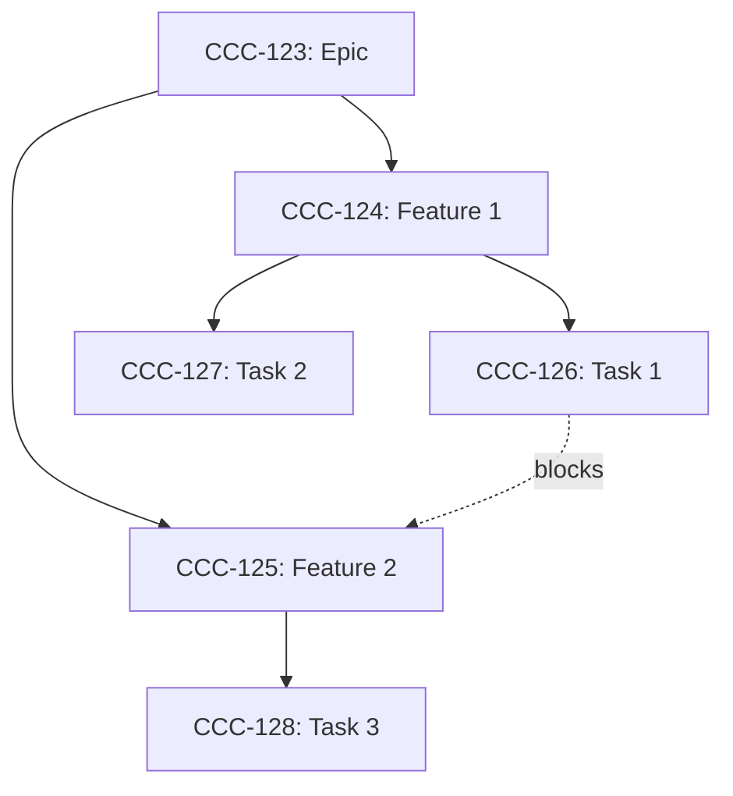

# Analyzing Dependencies

Map and visualize dependencies across work items to identify blockers and critical paths.

## Usage

```
/analyzing-dependencies [item-id | --epic EPIC | --sprint SPRINT] [options]
```

## Arguments

**Scope** (one required):
- `item-id`: Analyze dependencies for specific item and its children
- `--epic EPIC`: Analyze all items in an epic
- `--sprint SPRINT`: Analyze all items in a sprint

**Options:**
- `--depth N`: How many levels of dependencies to trace (default: all)
- `--format`: Output format (text|mermaid|json)
- `--blockers-only`: Only show blocking relationships

## Examples

```bash
# Analyze epic dependencies
/analyzing-dependencies --epic CCC-123

# Check what's blocking a specific item
/analyzing-dependencies CCC-456

# Sprint dependency map
/analyzing-dependencies --sprint CCC-123.S01

# Get mermaid diagram
/analyzing-dependencies --epic CCC-123 --format mermaid
```

## Workflow

### Step 1: Gather Items

```python
if item_id:
    root = pm_context.get_item(item_id)
    items = [root] + pm_context.get_children(item_id)
elif epic_id:
    items = get_epic_tree(epic_id)
elif sprint_id:
    items = pm_context.list_items({project: sprint_id})
```

### Step 2: Build Dependency Graph

```python
graph = {}
for item in items:
    graph[item.id] = {
        "item": item,
        "blocks": [],      # Items this blocks
        "blocked_by": [],  # Items blocking this
        "parent": item.parent_id,
        "children": []
    }

# Add dependency edges
for item in items:
    if item.blocked_by:
        for blocker_id in item.blocked_by:
            if blocker_id in graph:
                graph[blocker_id]["blocks"].append(item.id)
                graph[item.id]["blocked_by"].append(blocker_id)
```

### Step 3: Analyze Graph

**Find Circular Dependencies:**
```python
def find_cycles(graph):
    visited = set()
    path = []

    def dfs(node):
        if node in path:
            return path[path.index(node):]  # Cycle found
        if node in visited:
            return None

        visited.add(node)
        path.append(node)

        for blocked in graph[node]["blocks"]:
            cycle = dfs(blocked)
            if cycle:
                return cycle

        path.pop()
        return None

    cycles = []
    for node in graph:
        cycle = dfs(node)
        if cycle:
            cycles.append(cycle)
    return cycles
```

**Find Critical Path:**
```python
def find_critical_path(graph):
    # Topological sort + longest path
    in_degree = {n: len(graph[n]["blocked_by"]) for n in graph}
    queue = [n for n in graph if in_degree[n] == 0]
    dist = {n: 0 for n in graph}

    while queue:
        node = queue.pop(0)
        for blocked in graph[node]["blocks"]:
            dist[blocked] = max(dist[blocked], dist[node] + 1)
            in_degree[blocked] -= 1
            if in_degree[blocked] == 0:
                queue.append(blocked)

    # Reconstruct path
    max_node = max(dist, key=dist.get)
    return reconstruct_path(graph, max_node, dist)
```

**Find Blockers:**
```python
def find_blockers(graph):
    blockers = []
    for node_id, node in graph.items():
        if node["blocked_by"]:
            for blocker_id in node["blocked_by"]:
                blocker = graph.get(blocker_id)
                if blocker and blocker["item"].status_type != "done":
                    blockers.append({
                        "blocked": node["item"],
                        "blocker": blocker["item"],
                        "status": blocker["item"].status
                    })
    return blockers
```

### Step 4: Generate Report

**Text Format:**
```markdown
## Dependency Analysis: {scope}

### Summary
- Total Items: {count}
- Dependencies: {edge_count}
- Circular: {cycle_count}
- Currently Blocked: {blocked_count}

### Critical Path
{item1} → {item2} → {item3} → {item4}
Length: {path_length} items

### Circular Dependencies
⚠️ Cycle detected: {item1} → {item2} → {item3} → {item1}
   This must be resolved before execution.

### Active Blockers
{for blocker in blockers:}
🔴 [{blocker.key}] ({blocker.status}) blocks:
   - [{blocked1.key}] {blocked1.title}
   - [{blocked2.key}] {blocked2.title}

### Ready to Execute
{items with no unmet dependencies}

### Dependency Tree
{visual tree representation}
```

**Mermaid Format:**


## Output Examples

```
📊 Dependency Analysis: Epic CCC-123

Summary:
  Items: 15
  Dependencies: 8
  Cycles: 0 ✅
  Blocked: 3

Critical Path (5 items):
  CCC-124 → CCC-126 → CCC-130 → CCC-131 → CCC-132

Active Blockers:
  🔴 [CCC-126] Database Schema (In Progress)
     Blocks: CCC-130, CCC-131

  🔴 [CCC-127] API Setup (Todo)
     Blocks: CCC-129

Ready to Execute:
  ✅ CCC-124 - No dependencies
  ✅ CCC-125 - No dependencies
  ✅ CCC-128 - No dependencies
```

## Error Cases

| Issue | Action |
|-------|--------|
| Circular dependency | Report cycle, suggest resolution |
| External blocker | Note external dependency |
| Missing item | Warn about broken reference |
